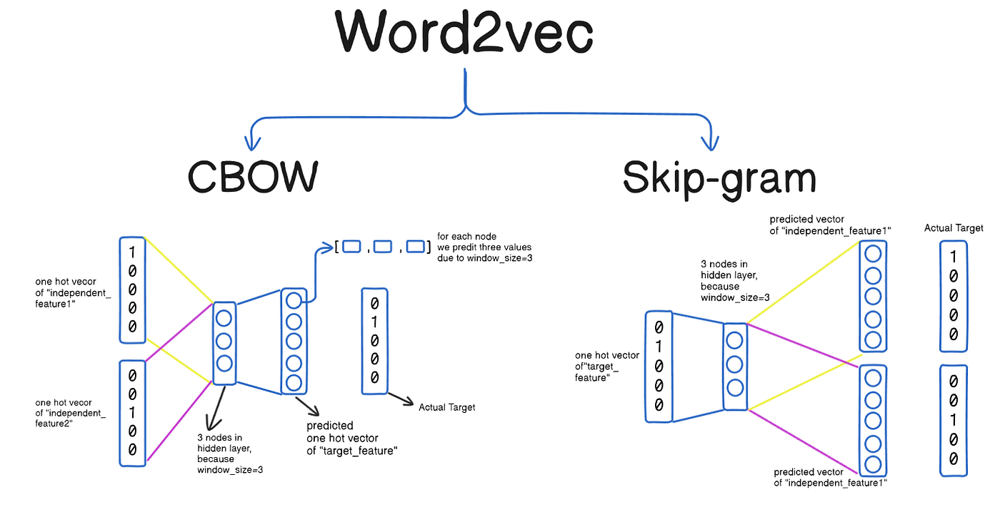
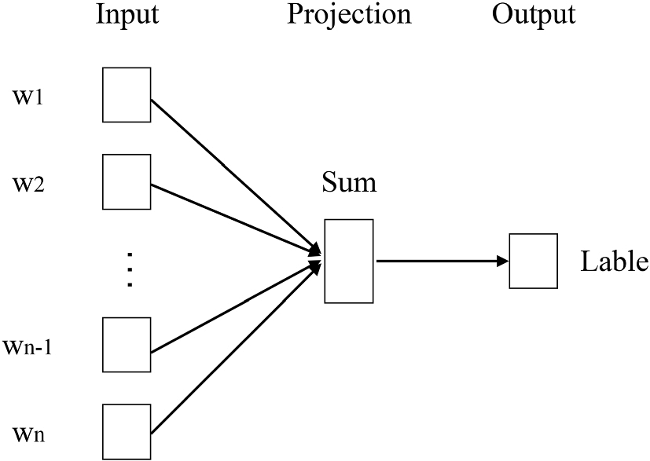
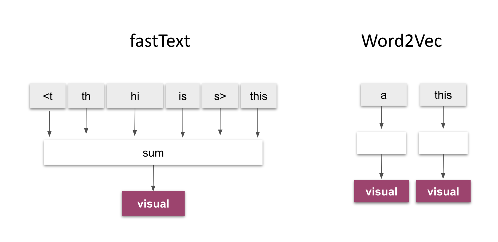

# Azerbaijani-Text-Preprocessing
Data cleaning, sentiment labeling, domain awareness, corpus merging, word embedding, some analysis to gain insight.

## ABSTRACT
The purpose of this work is to understand the basics of Natural Language Processing (NLP). In this project, we gained experience in data preprocessing, sentiment annotation, and word embedding. We used two different embedding models and analyzed their outputs on Azerbaijani language datas.

	•	Data cleaning, normalization, and sentiment labeling
	•	Domain-aware preprocessing (news, social, reviews)
	•	Merging datasets into a single corpus
	•	Training Word2Vec and FastText models
	•	Comparing their performance using lexical coverage, synonym/antonym similarity, and nearest-neighbor quality

# Contents
- [SETUP](#setup)
- [DATASETS](#datasets)
- [DOCUMENTATION](#documentation)
- [CONTRIBUTORS](#contributers)
- [ACKNOWLEDGMENT](#acknowledgment)

## SETUP 
[Last version](#lastversion):  

    git clone https://github.com/isoatalay/Ceng442-assignment1-Ismail.git

- Python 3
- pandas
- regex
- unicodedata
- ftfy
- gensim
- openpyxl

Install essentials:

    pip install pandas gensim openpyxl regex ftfy scikit-learn

## DATASETS
https://drive.google.com/file/d/1_nLlOQV1cYFHyN69fkYnnA5Grq-TvPtY/view?usp=sharing

## DOCUMENTATION
> Text Normalization :

In this part we gain to make a text meaningful and consistent . So model can train it easly. In this way  kind a models like Word2Vec, FastText etc. can established semantic relationship. We also create a domain awareness in this section to help the model detect and distinguish different contexts such as “news language,” “social media language,” and “product review language.”

Domain Detection: The model learns the meanings of words based on the text type.
Domain-Specific Normalization: This allows the model to recognize semantics, not numerical or formal meanings. This allows the model to match hints with emotional meanings.
Domain Label Symbol: This helps understand the different meanings of words, as sometimes the same words have different meanings (e.g., negative or positive).

We used the different datasets and than standardizes labels from different datasets into a uniform numeric sentiment value  (Negative = 0.0, Neutral = 0.5, Positive = 1.0) for training.

> Per-File Processing & Corpus Builder: 

We read the data files and performed the necessary cleaning, normalization, and labeling. As a result, we obtained the cleaned_text and sentiment_value values. To prevent the model from learning the same data over and over, we remove useless columns, null cells and duplicates to create a single corpus. This resulted in a clean and consistent text for model training.

> Embedding Training (Word2Vec & FastText) &  Model Comparison

We trained Word2vec (Skip-gram) and FasTest models using this dataset. The analysis shows that FastTest is better at grouping synonyms, but both models still struggle to distinguish antonyms.

        Synonyms: W2V=0.356, FT=0.435
        Antonyms: W2V=0.343, FT=0.435
        Separation: W2V=0.013, FT=0.001

Word2Vec works by looking at how often words occur in text. 

FastText, on the other hand, breaks words into smaller parts (subwords). 

FastText works better in agglutinative languages ​​like Azerbaijani.
## CONTRIBUTORS
- [@Beyhan Kandemir](https://github.com/Beykn) 
- [@İsmail Atalay](https://github.com/isoatalay)

## ACKNOWLEDGMENT

This project is part of the Natural Language Processing course.

We would like to thank  Yusuf Evren AYKAÇ for his guidance . We also referred to the paper “The Art of Natural Language Processing: Classical, Modern and Contemporary Approaches to Text Document Classification” for theoretical background and help to understanding NLP fundemantals.
